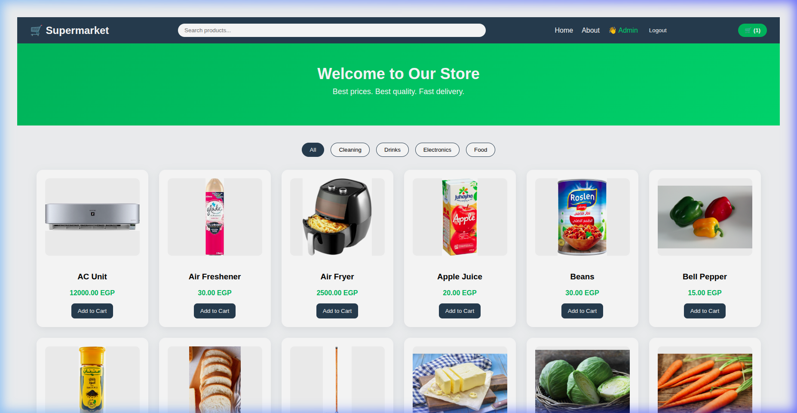
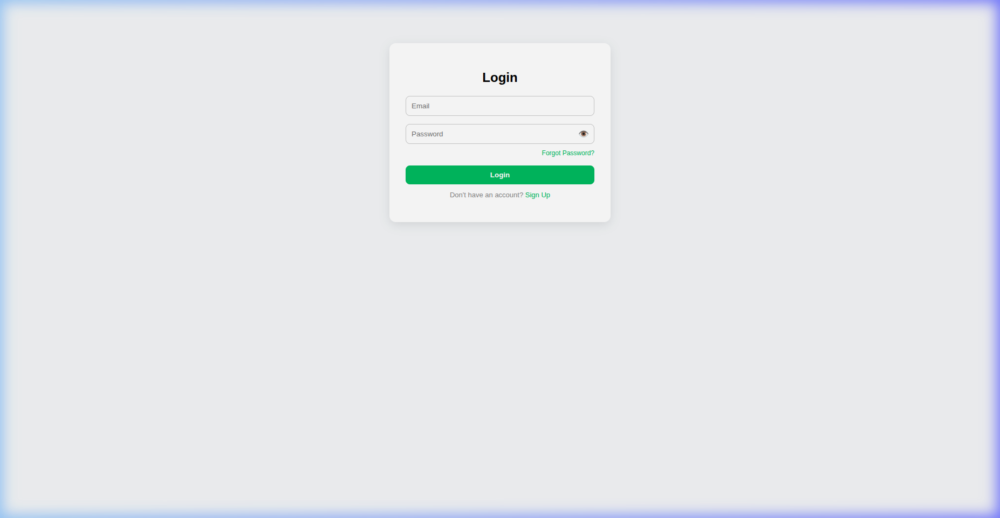
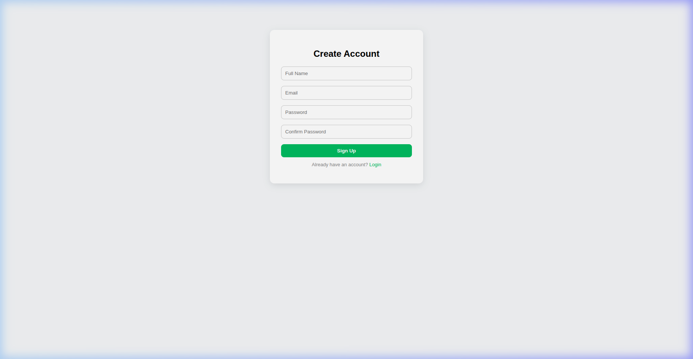
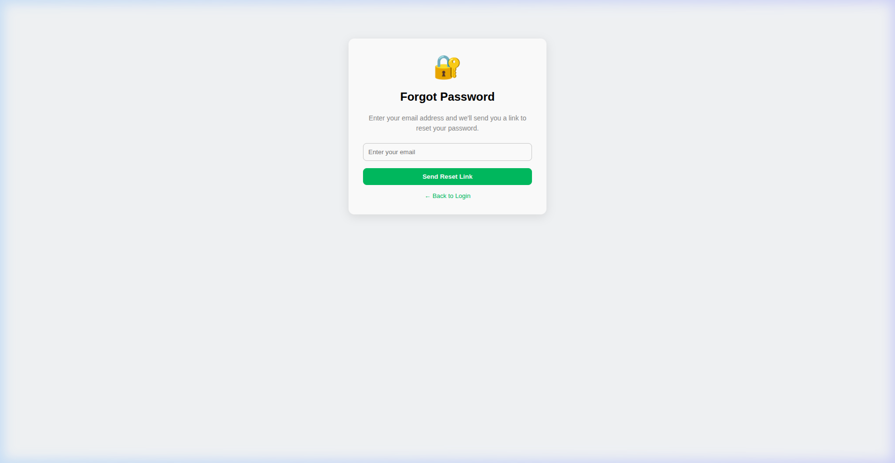

<div align="center">

# 🛒 Supermarket E-Commerce

A full-stack e-commerce supermarket application built with **React** and **Express.js** backed by **MySQL**.

Browse products, filter by category, manage your cart, and checkout — all connected to a real database with JWT authentication and email-based password recovery.



</div>

---

## 📑 Table of Contents

- [Features](#-features)
- [Tech Stack](#-tech-stack)
- [Architecture](#-architecture)
- [Database Schema](#-database-schema)
- [API Endpoints](#-api-endpoints)
- [Prerequisites](#-prerequisites)
- [Getting Started](#-getting-started)
- [Seeding the Database](#-seeding-the-database)
- [Running the Application](#-running-the-application)
- [Screenshots](#-screenshots)
- [Project Structure](#-project-structure)
- [Test Accounts](#-test-accounts)
- [Environment Variables](#-environment-variables)
- [License](#-license)

---

## ✨ Features

| Feature | Description |
|---------|-------------|
| 🏠 **Product Catalog** | Browse 76+ products across 4 categories with images & prices |
| 🔍 **Search & Filter** | Real-time search bar + category filter buttons |
| 🛒 **Shopping Cart** | Add/remove items, adjust quantities, persistent via localStorage |
| 💳 **Checkout & Payment** | Order summary, address input, card validation |
| 🔐 **Authentication** | JWT-based login & registration with secure bcrypt password hashing |
| 📧 **Password Recovery** | Forgot password flow with email delivery using Nodemailer |
| 👤 **User Greeting** | Personalized navbar with user name after login |
| ⚡ **MySQL Transactions** | Atomic order creation with `BEGIN` / `COMMIT` / `ROLLBACK` |
| 📦 **76 Seeded Products** | Food, Drinks, Cleaning, Electronics — all with local images |

---

## 🛠 Tech Stack

### Frontend
| Technology | Purpose |
|------------|---------|
| **React 19** | UI library |
| **React Router v7** | Client-side routing |
| **Vanilla CSS** | Styling (no frameworks) |
| **localStorage** | Cart persistence & auth state |

### Backend
| Technology | Purpose |
|------------|---------|
| **Express.js 4** | REST API server |
| **MySQL 8.0** | Relational database |
| **mysql2/promise** | MySQL driver with connection pooling |
| **bcryptjs** | Password hashing |
| **jsonwebtoken (JWT)** | Token-based authentication |
| **Nodemailer** | Email sending for password reset |
| **Docker** | MySQL container |

---

## 🏗 Architecture

```
┌──────────────────┐      fetch API       ┌──────────────────┐     mysql2/promise     ┌─────────────────┐
│                  │ ──────────────────▸   │                  │ ──────────────────▸    │                 │
│  React Frontend  │                       │  Express Backend │                        │   MySQL 8.0     │
│   (port 3000)    │ ◂──────────────────   │   (port 3006)    │ ◂──────────────────    │  (Docker:3307)  │
│                  │      JSON response    │                  │     query results      │                 │
└──────────────────┘                       └────────┬─────────┘                        └─────────────────┘
                                                    │
                                           express.static
                                                    │
                                                    ▼
                                           ┌─────────────────┐
                                           │  Product Images  │
                                           │  public/images/  │
                                           │   (77 files)     │
                                           └─────────────────┘
```

---

## 🗄 Database Schema

```
┌─────────────────────────────────┐       ┌──────────────────────────────────────┐
│           categories            │       │              products                │
├─────────────────────────────────┤       ├──────────────────────────────────────┤
│ id          INT (PK, AUTO_INC)  │──┐    │ id           INT (PK, AUTO_INC)     │
│ name        VARCHAR(100) UNIQUE │  │    │ name         VARCHAR(255)           │
└─────────────────────────────────┘  │    │ price        DECIMAL(10,2)          │
                                     └───▸│ category_id  INT (FK → categories)  │
┌─────────────────────────────────┐       │ image        VARCHAR(500)           │
│             users               │       │ stock        INT                    │
├─────────────────────────────────┤       │ created_at   TIMESTAMP              │
│ id           INT (PK, AUTO_INC) │─┐     └──────────────────────────────────────┘
│ name         VARCHAR(100)       │ │                        │
│ email        VARCHAR(255) UNIQ  │ │                        │ FK
│ password     VARCHAR(255)       │ │                        ▼
│ role         VARCHAR(20)        │ │     ┌──────────────────────────────────────┐
│ reset_token  VARCHAR(255)       │ │     │           order_items                │
│ reset_expires DATETIME          │ │     ├──────────────────────────────────────┤
│ created_at   TIMESTAMP          │ │     │ id           INT (PK, AUTO_INC)     │
└─────────────────────────────────┘ │     │ order_id     INT (FK → orders)      │
         │                          │     │ product_id   INT (FK → products)    │
         │ FK                       │     │ quantity     INT                    │
         ▼                          │     │ unit_price   DECIMAL(10,2)          │
┌─────────────────────────────────┐ │     └──────────────────────────────────────┘
│            orders               │ │                        ▲
├─────────────────────────────────┤ │                        │ FK
│ id          INT (PK, AUTO_INC)  │─┘     ───────────────────┘
│ user_id     INT (FK → users)    │
│ total       DECIMAL(10,2)       │
│ status      ENUM (pending,      │
│              completed,         │
│              cancelled)         │
│ created_at  TIMESTAMP           │
└─────────────────────────────────┘
```

---

## 🔌 API Endpoints

### Authentication
| Method | Endpoint | Body | Description |
|--------|----------|------|-------------|
| `POST` | `/api/auth/register` | `{ name, email, password }` | Register new user → returns JWT |
| `POST` | `/api/auth/login` | `{ email, password }` | Login → returns JWT |
| `POST` | `/api/auth/forgot-password` | `{ email }` | Sends password reset email |
| `POST` | `/api/auth/reset-password` | `{ token, password }` | Resets password using token |

### Products & Categories
| Method | Endpoint | Description |
|--------|----------|-------------|
| `GET` | `/api/products` | List all products |
| `GET` | `/api/products?category=Drinks` | Filter products by category |
| `GET` | `/api/products/:id` | Get single product |
| `GET` | `/api/categories` | List all categories |

### Orders
| Method | Endpoint | Body / Query | Description |
|--------|----------|--------------|-------------|
| `POST` | `/api/orders` | `{ user_id, items, total }` | Create order (transactional) |
| `GET` | `/api/orders?email=X` | — | Get user's order history |
| `GET` | `/api/orders/:id` | — | Get single order with items |

### Health
| Method | Endpoint | Description |
|--------|----------|-------------|
| `GET` | `/api/health` | Server health check |

---

## 📋 Prerequisites

Before you begin, ensure you have the following installed:

- **Node.js** v18+ and **npm** v9+
- **Docker** (for running MySQL) or a local MySQL 8.0 installation
- **Git**

---

## 🚀 Getting Started

### 1. Clone the Repository

```bash
git clone https://github.com/ahmedyassien7/super-final.git
cd super-final
```

### 2. Start MySQL (Docker)

```bash
docker run -d --name supermarket-mysql \
  -e MYSQL_ROOT_PASSWORD=root123 \
  -e MYSQL_DATABASE=supermarket_db \
  -e MYSQL_USER=supermarket_user \
  -e MYSQL_PASSWORD=supermarket_pass \
  -p 3307:3306 \
  mysql:8.0 \
  --default-authentication-plugin=mysql_native_password
```

> **Note:** Wait ~15 seconds for MySQL to initialize before proceeding.

### 3. Install Dependencies

```bash
# Frontend dependencies
npm install

# Backend dependencies
cd server
npm install
```

### 4. Configure Environment

The `server/.env` file is pre-configured for local development:

```env
DB_HOST=localhost
DB_USER=supermarket_user
DB_PASSWORD=supermarket_pass
DB_NAME=supermarket_db
DB_PORT=3307
JWT_SECRET=supermarket_jwt_secret_key_2024_xKz9mN
PORT=3006
FRONTEND_URL=http://localhost:3000
```

---

## 🌱 Seeding the Database

The seed script populates the database with:
- **4 categories:** Food, Drinks, Cleaning, Electronics
- **76 products** with local images
- **5 users** (1 admin + 4 customers)

```bash
cd server
npm run seed
```

Expected output:

```
🌱  Seeding database...

✅ MySQL tables initialised
✅  Categories seeded: Food, Drinks, Cleaning, Electronics
✅  76 products seeded
✅  Admin user created: admin@test.com / 123456
✅  Customer created: customer1@test.com / pass12
✅  Customer created: customer2@test.com / pass34
✅  Customer created: customer3@test.com / pass56
✅  Customer created: customer4@test.com / pass78

🎉  Seeding complete!
```

---

## ▶️ Running the Application

### Start the Backend

```bash
cd server
npm run dev      # Development with auto-reload (nodemon)
# or
npm start        # Production
```

The API will be available at **http://localhost:3006**.

### Start the Frontend

```bash
# From the project root
npm start
```

The app will open at **http://localhost:3000**.

### Quick Verify

```bash
# Health check
curl http://localhost:3006/api/health

# Products
curl http://localhost:3006/api/products | head -c 200

# Login
curl -X POST http://localhost:3006/api/auth/login \
  -H "Content-Type: application/json" \
  -d '{"email":"admin@test.com","password":"123456"}'
```

---

## 📸 Screenshots

<div align="center">

### 🏠 Home Page
*Browse products, filter by category, search, and add to cart*


---

### 🔐 Login Page
*Secure login with email & password, show/hide password toggle*



---

### 📝 Sign Up Page
*Create a new account with name, email, and password confirmation*



---

### 🔑 Forgot Password
*Email-based password recovery — sends a styled HTML email with a reset link*



</div>

---

## 📁 Project Structure

```
super-final/
├── public/
│   ├── images/                # 77 product images (jpg)
│   └── index.html
├── src/
│   ├── api/
│   │   └── api.js             # Axios base config
│   ├── data/
│   │   └── products.js        # Static product data (legacy)
│   ├── pages/
│   │   ├── Home.jsx           # Main page — products, cart, navbar
│   │   ├── About.jsx          # About us page
│   │   ├── login.jsx          # Login form
│   │   ├── signup.jsx         # Registration form
│   │   ├── payment.jsx        # Checkout & payment
│   │   ├── forgotpassword.jsx # Password recovery
│   │   └── resetpassword.jsx  # Password reset form
│   ├── styles/
│   │   └── style.css          # Main stylesheet
│   ├── App.js                 # React Router setup
│   └── index.js               # Entry point
├── server/
│   ├── routes/
│   │   ├── auth.js            # Login, register, forgot/reset password
│   │   ├── products.js        # Product CRUD
│   │   ├── categories.js      # Category listing
│   │   └── orders.js          # Order creation & history
│   ├── utils/
│   │   └── mailer.js          # Nodemailer email utility
│   ├── database.js            # MySQL pool + table initialization
│   ├── seed.js                # Database seeding script
│   ├── server.js              # Express app entry point
│   ├── package.json           # Backend dependencies
│   └── .env                   # Environment configuration
├── docs/
│   └── screenshots/           # App screenshots
├── package.json               # Frontend dependencies
└── README.md
```

---

## 👤 Test Accounts

| Email | Password | Role |
|-------|----------|------|
| `admin@test.com` | `123456` | Admin |
| `customer1@test.com` | `pass12` | Customer |
| `customer2@test.com` | `pass34` | Customer |
| `customer3@test.com` | `pass56` | Customer |
| `customer4@test.com` | `pass78` | Customer |

---

## ⚙️ Environment Variables

Create a `server/.env` file (included in the repository for development):

| Variable | Default | Description |
|----------|---------|-------------|
| `DB_HOST` | `localhost` | MySQL host |
| `DB_USER` | `supermarket_user` | MySQL username |
| `DB_PASSWORD` | `supermarket_pass` | MySQL password |
| `DB_NAME` | `supermarket_db` | Database name |
| `DB_PORT` | `3307` | MySQL port |
| `JWT_SECRET` | (set) | JWT signing secret |
| `PORT` | `3006` | Backend server port |
| `FRONTEND_URL` | `http://localhost:3000` | Frontend URL (for reset links) |
| `SMTP_HOST` | (empty) | SMTP server (e.g., `smtp.gmail.com`) |
| `SMTP_PORT` | `587` | SMTP port |
| `SMTP_USER` | (empty) | SMTP username |
| `SMTP_PASS` | (empty) | SMTP password / app password |
| `SMTP_FROM` | `Supermarket <no-reply@supermarket.com>` | Sender address |

> **Email:** When `SMTP_HOST` is empty, the app uses [Ethereal](https://ethereal.email) test accounts automatically. Emails are captured and viewable via a preview URL printed in the server console. To send real emails, configure Gmail SMTP with an [App Password](https://myaccount.google.com/apppasswords).

---

## 📄 License

This project is for educational purposes.

---

<div align="center">

**Built with ❤️ using React + Express + MySQL**

</div>
